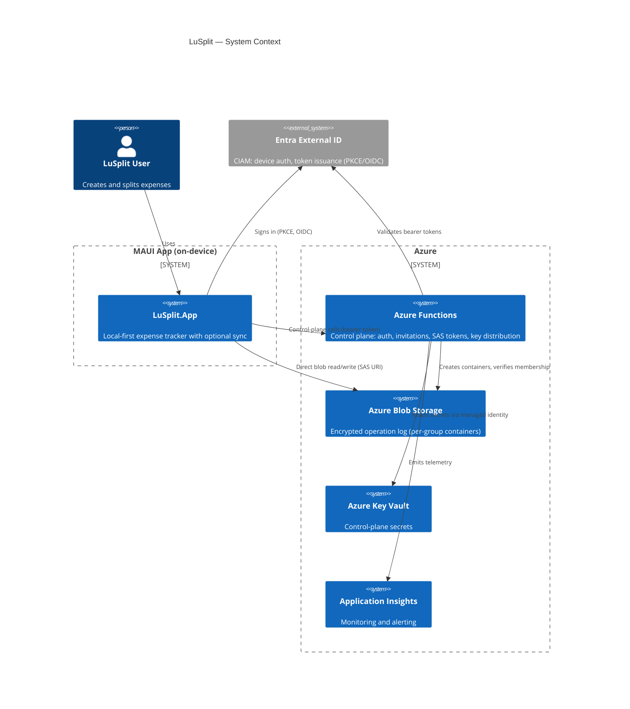
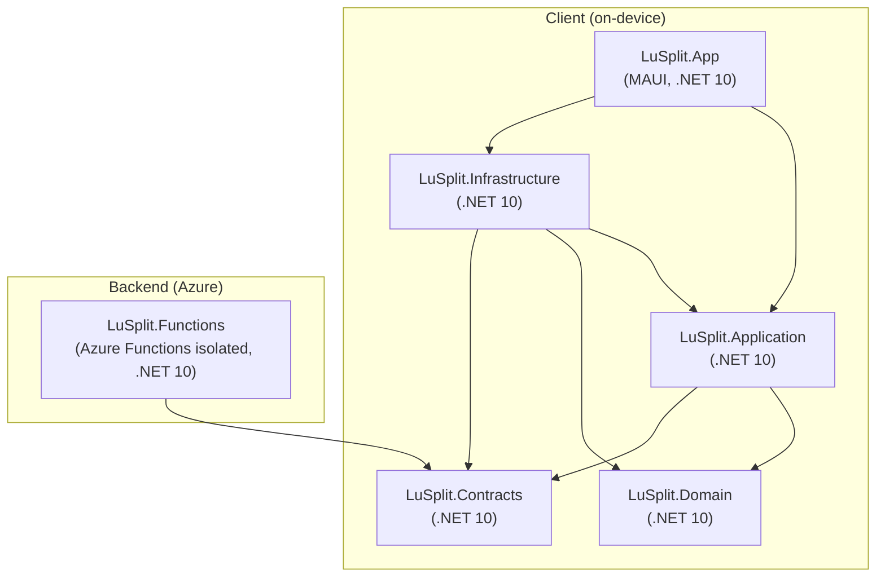
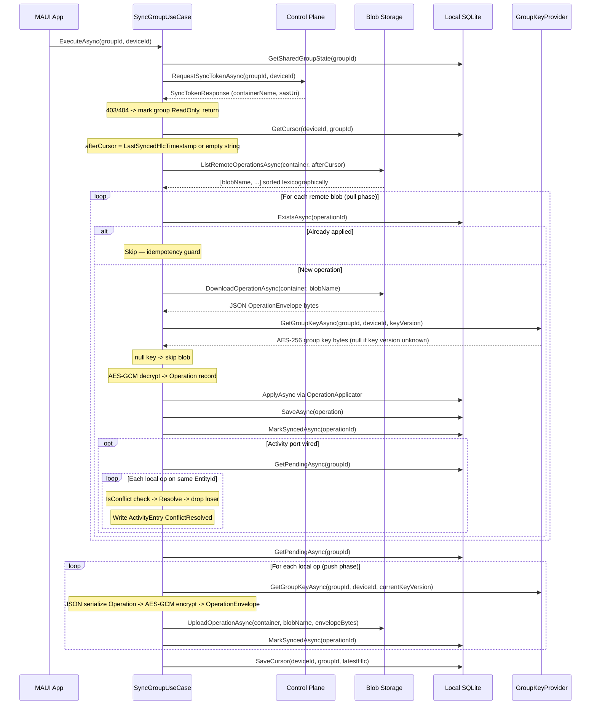
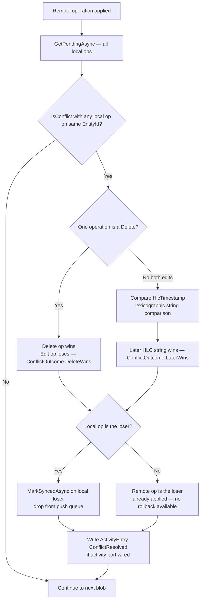
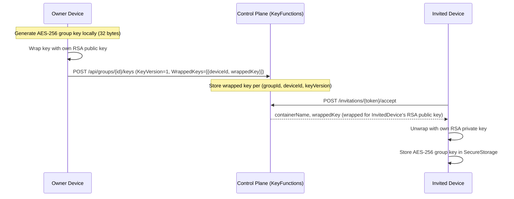
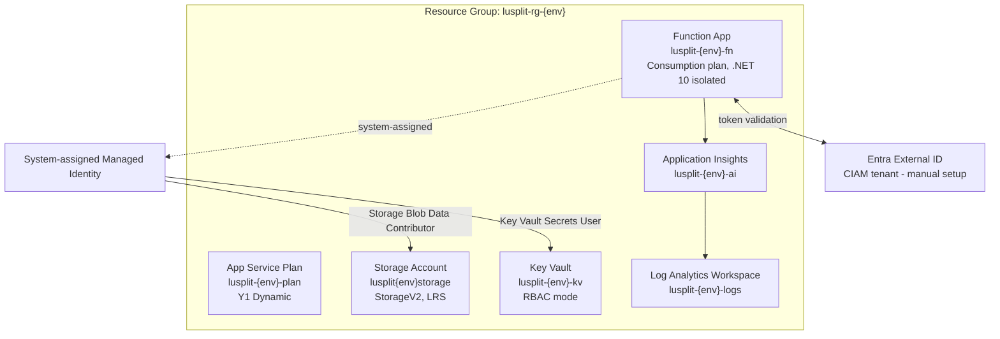

# Architecture

LuSplit is a local-first .NET MAUI application.
The Phase 2 Shared Sync Groups feature extends it with a minimal Azure control plane, encrypted operation-log sync, and multi-device shared groups — without altering local-only behavior or domain calculations.

---

## Table of Contents

1. [High-Level Architecture](#1-high-level-architecture)
2. [Container and Component View](#2-container-and-component-view)
3. [Sync Architecture](#3-sync-architecture)
4. [Control Plane Responsibilities](#4-control-plane-responsibilities)
5. [Security Model](#5-security-model)
6. [Deployment Architecture](#6-deployment-architecture)
7. [Presentation Pattern](#7-presentation-pattern)
8. [Layer Rules and Non-Goals](#8-layer-rules-and-non-goals)

---

## 1. High-Level Architecture

LuSplit consists of three runtime surfaces: the MAUI client app running on-device, the Azure Functions control plane, and Azure Blob Storage as the encrypted operation log. Microsoft Entra External ID provides identity. Azure Key Vault stores secrets for the control plane.



### Local-first guarantee

All reads and writes happen against local SQLite first. Sync is additive: it never blocks the core expense flow and the app remains fully functional offline. The control plane and Blob Storage are unreachable without network access; the app degrades gracefully into an offline-only state.

### Data flow summary

```
  MAUI App                  Control Plane              Blob Storage
  ─────────────────────     ────────────────────────   ──────────────────────
  1. Sign in via MSAL  ──►  Entra External ID
  2. Request SAS token ──►  Verify membership
                        ◄── Return SAS URI (scoped)
  3. Push/pull blobs   ─────────────────────────────►  ops/{hlc}_{opId} blobs
  4. Decrypt locally   (group key from secure storage)
```

---

## 2. Container and Component View

The solution contains **six deployable projects** plus Bicep infrastructure:



### 2.1 LuSplit.Domain

Owns pure business rules and immutable value types. No persistence, no UI, no network.

**Phase 2 additions** — Domain now also owns sync primitives and deterministic conflict policies:

| Namespace | Types | Purpose |
|-----------|-------|---------|
| `Domain.Sync` | `Operation`, `OperationType`, `SyncCursor`, `ConflictResolutionPolicy`, `ConflictResolutionResult`, `ConflictOutcome` | Sync value types and deterministic conflict resolution rules |
| `Domain.Groups` | `SharedGroupState`, `GroupMembership`, `MemberRole`, `GroupKey`, `WrappedKeyEntry`, `KeyRotationPolicy` | Shared group state, membership, key versioning |
| `Domain.Activity` | `ActivityEntry`, `ActivityEntryType` | Audit log entries for sync and membership events |
| `Domain.Invitations` | `Invitation`, `InvitationStatus` | Invitation lifecycle value type |
| `Domain.Identity` | `Device` | Device identity value type |

**Rules**: Depends on nothing. No MAUI, no network, no persistence. Deterministic and unit-testable.

> **Architectural note**: Domain intentionally owns `ConflictResolutionPolicy` because conflict rules are business invariants — they must be deterministic, testable in isolation, and independent of any infrastructure. Application orchestrates _when_ to apply them; Domain defines _how_.

### 2.2 LuSplit.Application

Owns use cases, queries, ports, and application models. Defines contracts for Infrastructure.

| Folder | Contents |
|--------|---------|
| `Expenses/` | AddExpense, EditExpense, DeleteExpense use cases and queries |
| `Payments/` | RecordPayment, AddTransfer use cases and queries |
| `Groups/` | CreateGroup, ShareGroup queries; `IGroupRepository`, `IGroupRegistrationPort`, `ISharedGroupStateRepository` |
| `Sync/` | `SyncGroupUseCase`, `OperationApplicator`, `GetSyncStatusQuery`; ports: `ISyncPort`, `IOperationRepository`, `ISyncCursorRepository`, `IGroupKeyProvider` |
| `Identity/` | `RegisterDeviceUseCase`; port: `IDeviceRegistrationPort` |
| `Invitations/` | `CreateInvitationUseCase`, `AcceptInvitationUseCase`, `DeclineInvitationUseCase`, `GetPendingInvitationsQuery`; port: `IInvitationPort` |
| `KeyManagement/` | `RotateGroupKeyUseCase`; port: `IKeyRotationPort` |
| `Revocation/` | `RevokeMemberUseCase`, `TransferOwnershipUseCase`; port: `IRevocationPort` |
| `Shared/Ports/` | `IAuthPort`, `IEncryptionPort`, `IKeyWrapPort`, `ISecureKeyStoragePort`, `IActivityEntryPort`, `IIdGenerator`, `IClock` |

**Rules**: Depends on `LuSplit.Domain` and `LuSplit.Contracts` only. No MAUI, no network calls, no persistence implementations.

### 2.3 LuSplit.Infrastructure

Implements Application ports. All side-effecting I/O lives here.

| Folder | Adapter | Implements |
|--------|---------|-----------|
| `Crypto/` | `AesGcmEncryptionAdapter` | `IEncryptionPort` |
| `Crypto/` | `RsaKeyWrapAdapter` | `IKeyWrapPort` |
| `Crypto/` | `SecureKeyStorageAdapter` | `ISecureKeyStoragePort` |
| `Identity/` | `MsalAuthAdapter` | `IAuthPort` |
| `Sync/` | `BlobSyncAdapter` | `ISyncPort` |
| `Sync/` | `GroupKeyProvider` | `IGroupKeyProvider` |
| `Sync/` | `OperationRepositorySqlite` | `IOperationRepository` |
| `Sync/` | `SyncCursorRepositorySqlite` | `ISyncCursorRepository` |
| `ControlPlane/` | `DeviceRegistrationAdapter` | `IDeviceRegistrationPort` |
| `ControlPlane/` | `GroupRegistrationAdapter` | `IGroupRegistrationPort` |
| `ControlPlane/` | `InvitationAdapter` | `IInvitationPort` |
| `ControlPlane/` | `MemberRevocationAdapter` | `IRevocationPort` |
| `ControlPlane/` | `KeyRotationAdapter` | `IKeyRotationPort` |
| `Groups/` | `SharedGroupStateRepositorySqlite` | `ISharedGroupStateRepository` |
| `Groups/` | `GroupMembershipRepositorySqlite` | `IGroupMembershipRepository` |
| `Activity/` | `ActivityEntryRepository` | Activity insert and list |

`ControlPlaneHttpClient` is an infrastructure-internal HTTP wrapper with bearer-token injection and exponential-backoff retry (delays: 500 ms -> 1 s -> 2 s) shared by all control-plane adapters.

`InfraLocalSqlite` is the composition root for all SQLite repositories.

`BlobSyncAdapter` uses `SasTokenProvider` to obtain per-container SAS URIs and instantiates a scoped `BlobContainerClient` per call. Transient blob errors are retried with the same delay schedule as the HTTP client.

**Known gap**: `IGroupMemberPort` (used by `MemberListViewModel`) has no implementing adapter in Infrastructure. This must be resolved before `MemberListPage` is fully functional at runtime.

**Rules**: Depends on Application and Domain. No page logic, no ViewModel logic.

### 2.4 LuSplit.App

Owns the MAUI presentation layer, organized as vertical feature slices under `Features/`:

```
Features/
  Activity/          ActivityFeedPage, ActivityFeedViewModel
  Auth/              AuthenticationPage, AuthenticationViewModel
  Devices/           DeviceManagementPage, DeviceManagementViewModel
  Expenses/
    AddExpense/
    ExpenseDetails/  (includes ConflictReviewPromptViewModel)
    Shared/
  Groups/
    ArchivedGroups/
    ArchivedGroupView/
    CreateGroup/
    GroupDetails/
    GroupSwitcher/
    GroupTimeline/
    Shared/
  Home/
  Invitations/       InvitationLandingPage, InvitationLandingViewModel
  Members/           MemberListPage, MemberListViewModel
  Payments/
    RecordPayment/
    Settlement/
  Settings/
  SharedGroups/      ShareGroupPage, ShareGroupViewModel
  Sync/              SyncStatusViewModel, sync state bindings
Services/
  Persistence/       AppDataService (SQLite composition root for App layer)
  SyncOrchestrationService
  ConflictFlagStore
```

**SyncOrchestrationService** is the app-side sync scheduler. It gates concurrent sync with a `SemaphoreSlim`, lazily creates `SyncGroupUseCase` instances per group via `AppDataService`, and updates per-group `SyncState` (Idle -> Syncing -> UpToDate | Error). It exposes a `SyncStateChanged` event that ViewModels bind for ambient sync indicators.

**ConflictFlagStore** is an in-memory singleton tracking entity IDs whose last sync cycle produced a conflict. `ConflictReviewPromptViewModel` reads it when `ExpenseDetailsPage` loads to surface a lightweight review prompt.

> **Current limitation**: `AppDataService.BuildSyncGroupUseCaseAsync` does not wire `IActivityEntryPort`, `IIdGenerator`, or `IClock` into `SyncGroupUseCase` or `OperationApplicator`. Activity logging and conflict `ActivityEntry` writing are therefore inactive at runtime despite being implemented in the use cases.

**Rules**: Depends on Application. Code-behind contains only `InitializeComponent`, `BindingContext`, and minimal lifecycle wiring. No business rules, no persistence orchestration in pages or code-behind.

### 2.5 LuSplit.Contracts

Shared wire types referenced by both `LuSplit.Infrastructure` (client) and `LuSplit.Functions` (server).

| Namespace | Types |
|-----------|-------|
| `Contracts.Sync` | `OperationEnvelope` (KeyVersion, Nonce, Ciphertext, AuthTag) |
| `Contracts.Sync.Payloads` | `AddExpensePayload`, `EditExpensePayload`, `DeleteExpensePayload`, `AddParticipantPayload`, `EditParticipantPayload`, `RecordPaymentPayload`, `EditPaymentPayload`, `DeletePaymentPayload`, `AddTransferPayload`, `EditTransferPayload`, `DeleteTransferPayload`, `SplitLinePayload` |
| `Contracts.ControlPlane` | All request/response DTOs for the control-plane HTTP API |

### 2.6 LuSplit.Functions

Azure Functions isolated worker (`net10.0`, v4). Implements the control plane. See Section 4 for the full endpoint inventory.

---

## 3. Sync Architecture

### 3.1 Operation Model

The sync system is built around an append-only encrypted operation log stored in Azure Blob Storage. Each operation represents a single mutation to the group state.

**Logical layer** — `LuSplit.Domain.Sync.Operation` (decrypted, in-memory only):

| Field | Type | Description |
|-------|------|-------------|
| `OperationId` | `string` | UUID, globally unique |
| `GroupId` | `string` | Group this operation belongs to |
| `DeviceId` | `string` | Originating device |
| `UserId` | `string` | Originating user |
| `HlcTimestamp` | `string` | Hybrid Logical Clock value — lexicographically sortable string |
| `OperationType` | `OperationType` | AddExpense, EditExpense, DeleteExpense, AddParticipant, EditParticipant, RecordPayment, EditPayment, DeletePayment, AddTransfer, EditTransfer, DeleteTransfer |
| `EntityId` | `string` | ID of the affected entity (expense, participant, transfer) |
| `EncryptedPayload` | `byte[]` | Typed payload bytes — deserialized after decryption |
| `KeyVersion` | `int` | Group key version used to encrypt |
| `CreatedAt` | `DateTimeOffset` | Device wall clock — display only, not used for ordering |

**Wire layer** — `LuSplit.Contracts.Sync.OperationEnvelope` (JSON-serialized to blob):

```json
{
  "KeyVersion": 1,
  "Nonce":      "<base64>",
  "Ciphertext": "<base64>",
  "AuthTag":    "<base64>"
}
```

> **Implementation note**: The `sync-operations.md` contract and `OperationEnvelope` XML comment describe a binary layout `[4 bytes KeyVersion][12 bytes Nonce][N bytes Ciphertext][16 bytes AuthTag]`. The actual implementation JSON-serializes `OperationEnvelope`. Any second client must use JSON deserialization.

### 3.2 HLC Ordering

Operations are ordered by **Hybrid Logical Clock (HLC) timestamps** stored as lexicographically sortable strings.

- HLC captures causality without synchronized wall clocks.
- The canonical algorithm: `HLC_new = max(local_HLC, last_known_remote_HLC) + 1`.
- **No HLC generator is implemented** in the current codebase. Callers assign `HlcTimestamp` values. `SyncGroupUseCase` treats them as opaque sortable strings.
- `BlobSyncAdapter.ListRemoteOperationsAsync` returns blob names in lexicographic order — this is the ordering guarantee.
- `SyncCursor.LastSyncedHlcTimestamp` records the HLC of the last successfully processed remote blob. Each sync fetches only blobs with names lexicographically after the cursor.

> **Spec divergence**: `spec.md` mentions "vector clock tiebreaking" and "server-issued timestamps for ordering". Neither is implemented. HLC string comparison is the sole ordering and cursor mechanism.

> **Type divergence**: `data-model.md` specifies `HlcTimestamp` as `long`. The implementation uses `string` throughout (domain record, SyncCursor record, SQLite `TEXT` column, blob naming). Lexicographic sort on strings requires zero-padded timestamps to preserve numeric ordering.

### 3.3 Blob Naming

```
Container: group-{groupId}

ops/{hlcTimestamp}_{operationId}     encrypted operation blobs
snapshots/{snapshotId}               encrypted group state snapshots
```

> **Contract divergence**: `sync-operations.md` specifies `ops/{hlcTimestamp}_{deviceId}.enc` (deviceId, `.enc` extension). The implementation uses `operationId` (not `deviceId`) and no `.enc` extension. The full device ID is inside the encrypted payload.

### 3.4 Sync Flow

`SyncGroupUseCase.ExecuteAsync(groupId, deviceId)` performs one full sync cycle:



**Idempotency**: `ExistsAsync` is checked before applying any remote operation. `SaveAsync` uses `INSERT OR IGNORE` semantics. A repeated sync run is a no-op for already-applied operations.

> **Known limitation**: `OperationRepositorySqlite.MarkSyncedAsync` is a no-op and `GetPendingAsync` returns all stored operations regardless of sync state. The push phase re-uploads all locally stored operations on every sync cycle. The pending-vs-synced distinction is not enforced at the repository layer.

### 3.5 Conflict Resolution

Conflict detection and resolution run during the pull phase, once per remote operation.



**Rules from `ConflictResolutionPolicy`** (priority order):

1. Operations on different `EntityId` values: not a conflict.
2. Two additions (`AddExpense`, `AddParticipant`, `RecordPayment`, `AddTransfer`): commutative, not a conflict.
3. Identical `OperationId`: duplicate, not a conflict.
4. Delete beats any edit regardless of HLC timestamp (`ConflictOutcome.DeleteWins`).
5. Edit vs edit: lexicographically later `HlcTimestamp` wins (`ConflictOutcome.LaterWins`).

> **Rollback limitation**: When the remote operation wins and the local operation loses, the remote operation has already been applied to local repositories. There is no rollback of applied state. The local losing operation is silently dropped from the push queue.

### 3.6 Snapshot Mechanism

`ISyncPort` defines `WriteSnapshotAsync` and `ReadLatestSnapshotAsync`; `BlobSyncAdapter` implements them (`snapshots/{snapshotId}` blobs). `SyncGroupUseCase` does **not** call either method. Snapshots are defined but not integrated into the sync cycle in the current implementation.

### 3.7 Initial Sync

On first sync for a device, `cursor` is null and `afterCursor` is an empty string. `ListRemoteOperationsAsync` returns all blobs in `ops/` in lexicographic order. All operations are applied sequentially. This is the full history replay path.

---

## 4. Control Plane Responsibilities

### What the control plane DOES

The control plane handles authorization, metadata, and key distribution. It never sees decrypted group content.

#### Device Registration (`DeviceFunctions`)

| Method | Path | Description |
|--------|------|-------------|
| `POST` | `/api/devices/register` | Register a new device; stores device public key |
| `GET` | `/api/devices` | List all devices for the authenticated user |
| `POST` | `/api/devices/{deviceId}/revoke` | Revoke a device |

#### Group Management (`GroupFunctions`)

| Method | Path | Description |
|--------|------|-------------|
| `POST` | `/api/groups` | Register a group as shared; creates Blob Storage container |
| `GET` | `/api/groups/{groupId}` | Get group metadata and membership list |

#### Sync Token Issuance (`SyncFunctions`)

| Method | Path | Description |
|--------|------|-------------|
| `POST` | `/api/groups/{groupId}/sync-token` | Verify membership, issue scoped SAS URI |

> **Current state**: Issues an account-key SAS (`GenerateSasUri`). Membership verification is a placeholder comment.
> **Target state**: User Delegation SAS via `GetUserDelegationKey` + `BlobSasBuilder`, with JWT membership verification from Entra token claims.

#### Invitations (`InvitationFunctions`)

| Method | Path | Description |
|--------|------|-------------|
| `POST` | `/api/groups/{groupId}/invitations` | Create invitation (owner only) |
| `DELETE` | `/api/groups/{groupId}/invitations/{invitationId}` | Cancel invitation |
| `GET` | `/api/invitations/{token}/info` | Get invitation info (public endpoint) |
| `POST` | `/api/invitations/{token}/accept` | Accept invitation; returns container name and wrapped group key |
| `POST` | `/api/invitations/{token}/decline` | Decline invitation |

#### Membership and Revocation (`MemberFunctions`)

| Method | Path | Description |
|--------|------|-------------|
| `POST` | `/api/groups/{groupId}/members/{userId}/revoke` | Revoke a member; marks key rotation required |
| `POST` | `/api/groups/{groupId}/transfer-ownership` | Transfer group ownership |

#### Key Management (`KeyFunctions`)

| Method | Path | Description |
|--------|------|-------------|
| `POST` | `/api/groups/{groupId}/keys` | Upload rotated group key (validates version monotonicity; returns 409 if not) |
| `GET` | `/api/groups/{groupId}/keys?deviceId={deviceId}` | Get all wrapped key versions for a device |

### What the control plane DOES NOT DO

- Read, decrypt, or process operation payloads or group content
- Compute balances, splits, or settlements
- Enforce business rules about expenses or participants
- Store unencrypted group data
- Participate in the sync cycle (blobs go directly client to Blob Storage)
- Issue group keys or generate encryption material (keys are generated on-device)
- Act as a message broker or real-time relay

### Authentication

> **Current state**: All Functions use `AuthorizationLevel.Anonymous`. User identity is extracted from an `X-User-Id` header or query parameter — not a validated JWT. Membership checks are placeholder comments.
>
> **Target state**: Bearer token from Entra External ID validated by `EntraTokenValidationMiddleware`. User ID extracted from validated JWT claims. SAS issuance and all mutating endpoints gated on verified membership.

---

## 5. Security Model

### End-to-End Encryption

Group content is encrypted client-side before leaving the device. The control plane and Blob Storage handle ciphertext only.

**Encryption**: AES-256-GCM (`AesGcmEncryptionAdapter`). Per-operation random 12-byte nonce generated by `RandomNumberGenerator.GetBytes`. 16-byte authentication tag appended to ciphertext by `AesGcm.Encrypt`. Both nonce and tag stored in `OperationEnvelope`.

**Key wrapping**: The group key (AES-256, 32 bytes) is wrapped per-device using RSA-OAEP-SHA256 (`RsaKeyWrapAdapter`). `WrapKey(byte[] keyToWrap, byte[] recipientPublicKey)` imports the public key as SubjectPublicKeyInfo. `UnwrapKey(byte[] wrappedKey, byte[] devicePrivateKey)` imports as PKCS#8. Each device holds its RSA private key in `SecureStorage`.

**Secure storage on device**: `SecureKeyStorageAdapter` backed by MAUI `SecureStorage`:
- Android: EncryptedSharedPreferences + Android Keystore
- iOS: Keychain Services
- Windows: DataProtectionProvider

### Group Key Lifecycle



### Key Rotation

Triggered by `RevokeMemberUseCase`:

1. Control plane marks membership as revoked.
2. `RotateGroupKeyUseCase.ExecuteAsync(groupId)`:
   a. `RandomNumberGenerator.Fill` generates a new 32-byte AES-256 key.
   b. `IKeyRotationPort.GetDevicePublicKeysAsync` fetches all active device public keys.
   c. `IKeyWrapPort.WrapKey` wraps the new key per device.
   d. `IKeyRotationPort.UploadRotatedKeyAsync` uploads all wrapped keys with `NewKeyVersion = CurrentKeyVersion + 1`.
   e. `KeyRotationPolicy.IsVersionMonotonic` validated client-side and server-side (409 on failure).
   f. `ISharedGroupStateRepository.SaveAsync` updates `CurrentKeyVersion` locally.
3. Revoked devices cannot obtain the new key version from `GET /api/groups/{groupId}/keys`.
4. Operations from before rotation remain readable (full key chain stored per-version in Key Vault).

`KeyVersion` is stored as blob metadata tag (`BlobUploadOptions.Metadata["KeyVersion"]`) during `UploadOperationAsync` so readers can identify which key version to request without full envelope deserialization.

### Trust Boundaries

| Surface | Trust level | Rationale |
|---------|-------------|-----------|
| MAUI client (own device) | Trusted | RSA private key in device secure storage; not exportable |
| Other group member devices | Partially trusted | Content integrity via AES-GCM auth tag; mutual group membership |
| Azure Blob Storage | Untrusted for content | Sees ciphertext only; SAS scopes limit container access |
| Azure Functions (control plane) | Untrusted for content | Handles metadata only; cannot decrypt operations |
| Azure Key Vault | Trusted for control-plane secrets | Holds wrapped device keys; no group plaintexts stored here |
| Network / TLS | Transport trust only | Content encrypted independently of TLS layer |

---

## 6. Deployment Architecture

### Azure Resources



### Bicep Module Inventory

| File | Provisions |
|------|-----------|
| `infra/main.bicep` | Orchestrator: composes all modules, emits outputs |
| `infra/modules/storage.bicep` | StorageV2 account for the encrypted operation log |
| `infra/modules/keyvault.bicep` | Key Vault (RBAC mode) for control-plane secrets |
| `infra/modules/identity.bicep` | Documentation/pass-through module; outputs authority values. Entra External ID created manually |
| `infra/modules/monitoring.bicep` | Log Analytics workspace, Application Insights, sync-error scheduled query alert |
| `infra/modules/functions.bicep` | Consumption plan, Function App, app settings, Storage Blob Data Contributor and Key Vault Secrets User RBAC assignments |
| `infra/parameters/dev.bicepparam` | Dev environment: westeurope, dev, lusplit |
| `infra/parameters/prod.bicepparam` | Prod environment: westeurope, prod, lusplit |

### `main.bicep` Outputs

- `storageAccountName`
- `keyVaultName`
- `functionAppName`
- `functionAppPrincipalId`

### Runtime Configuration

Function App app settings (set post-deploy, not in Bicep):

| Setting | Purpose |
|---------|---------|
| `AzureWebJobsStorage__accountName` | Functions host storage (managed identity auth) |
| `FUNCTIONS_WORKER_RUNTIME` | `dotnet-isolated` |
| `APPLICATIONINSIGHTS_CONNECTION_STRING` | Telemetry |
| `KeyVaultName` | Key Vault name for secret resolution |
| `Entra__TenantId` | CIAM tenant ID |
| `Entra__Authority` | OIDC authority URL |
| `Entra__ApiClientId` | API app registration client ID |
| `Entra__MobileClientId` | Mobile app registration client ID |
| `Entra__ApiAudience` | Expected audience for bearer token validation |
| `Entra__RequiredScope` | Required scope on incoming tokens |
| `Invite__BaseUrl` | Deep link base URL for invitation links |

### Entra External ID Setup (manual)

Entra External ID (CIAM) is not provisioned by Bicep. Required steps:

1. Create or identify a CIAM tenant.
2. Create a **public client** app registration for the MAUI app (PKCE/authorization code, mobile redirect URIs).
3. Create an **API app registration** for the Functions control plane (expose API scope, grant mobile app permission).
4. Supply `TenantId`, `ApiClientId`, `MobileClientId`, and `Authority` to Function App settings and MAUI app configuration.

See `infra/README_DEV.md` for the complete DEV bootstrap guide.

---

## 7. Presentation Pattern

LuSplit uses MVVM with `CommunityToolkit.Mvvm`.

Preferred primitives: `ObservableObject`, `[ObservableProperty]`, `[RelayCommand]`, `[NotifyCanExecuteChangedFor]`, `[NotifyPropertyChangedFor]`.

ViewModels live in `LuSplit.App/Features/<Feature>/`. They own:
- Page state
- Derived state
- Validation state
- Commands
- Orchestration of Application use cases and queries

Pages remain thin. Code-behind is limited to:
- `InitializeComponent()`
- `BindingContext = viewModel`
- Tiny lifecycle handoff (e.g., `OnAppearing` triggering a load command)
- Strictly view-only concerns (keyboard dismiss, scroll, animation)

### Vertical Slice Canon

Each non-trivial screen is a feature slice:

```
Features/<Feature>/
  <Feature>Page.xaml
  <Feature>Page.xaml.cs
  <Feature>ViewModel.cs
  [<Row>ViewModel.cs]         optional row/item viewmodels
  [I<Feature>DataService.cs]  optional UI-only data service interface
```

---

## 8. Layer Rules and Non-Goals

### Dependency Direction

```
LuSplit.Domain         <- depends on nothing
LuSplit.Application    <- depends on Domain, Contracts
LuSplit.Infrastructure <- depends on Application, Domain, Contracts
LuSplit.App            <- depends on Application (Infrastructure only for DI wiring)
LuSplit.Contracts      <- depends on nothing
LuSplit.Functions      <- depends on Contracts
```

### Non-Goals

LuSplit does not put:
- ViewModels in `Application`
- Persistence in pages or code-behind
- Domain rules in code-behind
- MAUI concerns in Domain, Application, or Infrastructure
- Sync orchestration in Domain (Domain owns only sync value types and deterministic policies)
- Conflict resolution in Infrastructure
- Account or sign-in gates on core expense tracking
- Real-time presence, typing indicators, or social-network patterns

### Known Architectural Risks

| Risk | Detail |
|------|--------|
| No HLC generator | HLC timestamps are caller-assigned strings. No code enforces `max(local, remote) + 1`. Ordering relies on lexicographic sort, requiring callers to format timestamps with consistent zero-padding. |
| Pending-state not tracked | `OperationRepositorySqlite.MarkSyncedAsync` is a no-op. `GetPendingAsync` returns all operations. Every sync cycle re-uploads all local operations to Blob Storage. |
| Activity logging inactive | `AppDataService` does not wire `IActivityEntryPort` into `SyncGroupUseCase`. Conflict `ActivityEntry` records are never written at runtime. |
| No JWT enforcement | Functions use `AuthorizationLevel.Anonymous`. Bearer token validation is not enforced. |
| Account-key SAS | `SyncFunctions` issues account-key SAS, not User Delegation SAS. Production target requires User Delegation SAS via managed identity. |
| Missing `IGroupMemberPort` adapter | `MemberListViewModel` resolves `IGroupMemberPort` from DI but no Infrastructure adapter implements this port. |

### Refactoring Rule

Refactors are done one slice at a time.

Goals:
- Preserve behavior
- Reduce code-behind responsibility
- Make slice structure predictable
- Keep changes small and reviewable
